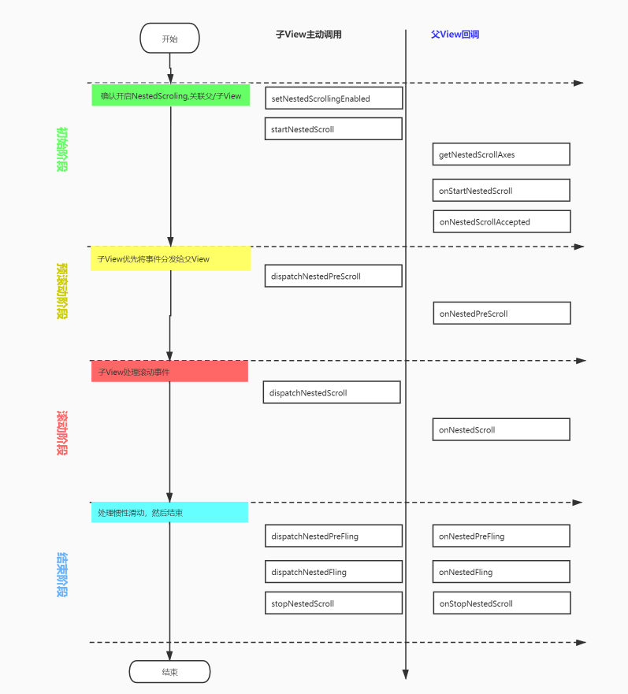

## NestedScrollview原理

> NestedChild与NestedParent事件交互




   
```java
public interface NestedScrollingChild {
    
    /**
    * 启用或禁用嵌套滚动的方法，设置为true，并且当前界面的View的层次结构是支持嵌套滚动的
    * (也就是需要NestedScrollingParent嵌套NestedScrollingChild)，才会触发嵌套滚动。
    * 一般这个方法内部都是直接代理给NestedScrollingChildHelper的同名方法即可
    */
void setNestedScrollingEnabled(boolean enabled);


/**
* 判断当前View是否支持嵌套滑动。一般也是直接代理给NestedScrollingChildHelper的同名方法即可
*/
boolean isNestedScrollingEnabled();

/**
* 表示view开始滚动了,一般是在ACTION_DOWN中调用，如果返回true则表示父布局支持嵌套滚动。
* 一般也是直接代理给NestedScrollingChildHelper的同名方法即可。这个时候正常情况会触发Parent的onStartNestedScroll()方法
*/
boolean startNestedScroll(@ScrollAxis int axes);

/**
* 一般是在事件结束比如ACTION_UP或者ACTION_CANCLE中调用,告诉父布局滚动结束。一般也是直接代理给NestedScrollingChildHelper的同名方法即可
*/
void stopNestedScroll();

/**
* 判断当前View是否有嵌套滑动的Parent。一般也是直接代理给NestedScrollingChildHelper的同名方法即可
*/
boolean hasNestedScrollingParent();

/**
* 在当前View消费滚动距离之后。通过调用该方法，把剩下的滚动距离传给父布局。如果当前没有发生嵌套滚动，或者不支持嵌套滚动，调用该方法也没啥用。
* 内部一般也是直接代理给NestedScrollingChildHelper的同名方法即可
* dxConsumed：被当前View消费了的水平方向滑动距离
* dyConsumed：被当前View消费了的垂直方向滑动距离
* dxUnconsumed：未被消费的水平滑动距离
* dyUnconsumed：未被消费的垂直滑动距离
* offsetInWindow：输出可选参数。如果不是null，该方法完成返回时，
* 会将该视图从该操作之前到该操作完成之后的本地视图坐标中的偏移量封装进该参数中，offsetInWindow[0]水平方向，offsetInWindow[1]垂直方向
* @return true：表示滚动事件分发成功,fasle: 分发失败
*/
boolean dispatchNestedScroll(int dxConsumed, int dyConsumed,
        int dxUnconsumed, int dyUnconsumed, @Nullable int[] offsetInWindow);

/**
* 在当前View消费滚动距离之前把滑动距离传给父布局。相当于把优先处理权交给Parent
* 内部一般也是直接代理给NestedScrollingChildHelper的同名方法即可。
* dx：当前水平方向滑动的距离
* dy：当前垂直方向滑动的距离
* consumed：输出参数，会将Parent消费掉的距离封装进该参数consumed[0]代表水平方向，consumed[1]代表垂直方向
* @return true：代表Parent消费了滚动距离
*/
boolean dispatchNestedPreScroll(int dx, int dy, @Nullable int[] consumed,
        @Nullable int[] offsetInWindow);

/**
*将惯性滑动的速度分发给Parent。内部一般也是直接代理给NestedScrollingChildHelper的同名方法即可
* velocityX：表示水平滑动速度
* velocityY：垂直滑动速度
* consumed：true：表示当前View消费了滑动事件，否则传入false
* @return true：表示Parent处理了滑动事件
*/
boolean dispatchNestedFling(float velocityX, float velocityY, boolean consumed);

/**
* 在当前View自己处理惯性滑动前，先将滑动事件分发给Parent,一般来说如果想自己处理惯性的滑动事件，
* 就不应该调用该方法给Parent处理。如果给了Parent并且返回true，那表示Parent已经处理了，自己就不应该再做处理。
* 返回false，代表Parent没有处理，但是不代表Parent后面就不用处理了
* @return true：表示Parent处理了滑动事件
*/
boolean dispatchNestedPreFling(float velocityX, float velocityY);
    
}
```


```java
public interface NestedScrollingParent {
    /**
    * 当NestedScrollingChild调用方法startNestedScroll()时,会调用该方法。主要就是通过返回值告诉系统是否需要对后续的滚动进行处理
    * child：该ViewParen的包含NestedScrollingChild的直接子View，如果只有一层嵌套，和target是同一个View
    * target：本次嵌套滚动的NestedScrollingChild
    * nestedScrollAxes：滚动方向
    * @return 
    * true:表示我需要进行处理，后续的滚动会触发相应的回到
    * false: 我不需要处理，后面也就不会进行相应的回调了
    */
    //child和target的区别，如果是嵌套两层如:Parent包含一个LinearLayout，LinearLayout里面才是NestedScrollingChild类型的View。这个时候，
    //child指向LinearLayout，target指向NestedScrollingChild；如果Parent直接就包含了NestedScrollingChild，
    //这个时候target和child都指向NestedScrollingChild
    boolean onStartNestedScroll(@NonNull View child, @NonNull View target, @ScrollAxis int axes);

/**
* 如果onStartNestedScroll()方法返回的是true的话,那么紧接着就会调用该方法.它是让嵌套滚动在开始滚动之前,
* 让布局容器(viewGroup)或者它的父类执行一些配置的初始化的
*/
void onNestedScrollAccepted(@NonNull View child, @NonNull View target, @ScrollAxis int axes);

/**
* 停止滚动了,当子view调用stopNestedScroll()时会调用该方法
*/
void onStopNestedScroll(@NonNull View target);

/**
* 当子view调用dispatchNestedScroll()方法时,会调用该方法。也就是开始分发处理嵌套滑动了
* dxConsumed：已经被target消费掉的水平方向的滑动距离
* dyConsumed：已经被target消费掉的垂直方向的滑动距离
* dxUnconsumed：未被tagert消费掉的水平方向的滑动距离
* dyUnconsumed：未被tagert消费掉的垂直方向的滑动距离
*/
void onNestedScroll(@NonNull View target, int dxConsumed, int dyConsumed,
        int dxUnconsumed, int dyUnconsumed);

/**
* 当子view调用dispatchNestedPreScroll()方法是,会调用该方法。也就是在NestedScrollingChild在处理滑动之前，
* 会先将机会给Parent处理。如果Parent想先消费部分滚动距离，将消费的距离放入consumed
* dx：水平滑动距离
* dy：处置滑动距离
* consumed：表示Parent要消费的滚动距离,consumed[0]和consumed[1]分别表示父布局在x和y方向上消费的距离.
*/
void onNestedPreScroll(@NonNull View target, int dx, int dy, @NonNull int[] consumed);

/**
* 你可以捕获对内部NestedScrollingChild的fling事件
* velocityX：水平方向的滑动速度
* velocityY：垂直方向的滑动速度
* consumed：是否被child消费了
* @return
* true:则表示消费了滑动事件
*/
boolean onNestedFling(@NonNull View target, float velocityX, float velocityY, boolean consumed);

/**
* 在惯性滑动距离处理之前，会调用该方法，同onNestedPreScroll()一样，也是给Parent优先处理的权利
* target：本次嵌套滚动的NestedScrollingChild
* velocityX：水平方向的滑动速度
* velocityY：垂直方向的滑动速度
* @return
* true：表示Parent要处理本次滑动事件，Child就不要处理了
*/
boolean onNestedPreFling(@NonNull View target, float velocityX, float velocityY);

/**
* 返回当前滑动的方向，一般直接通过NestedScrollingParentHelper.getNestedScrollAxes()返回即可
*/
@ScrollAxis
int getNestedScrollAxes();
}
```


> NestedScrollView嵌套recyclerView有性能问题吗


<https://juejin.im/post/6844903938395734024>