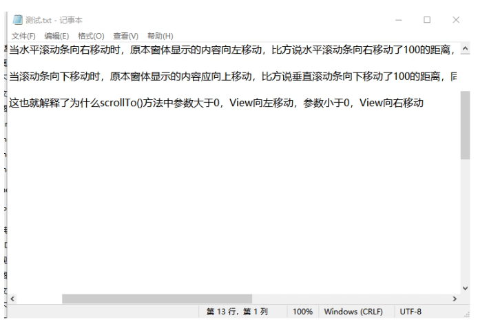

#### CoordinatorLayout协调者布局

[kəʊˈɔːdɪneɪtə(r)] 

> 理解ScrollTo、ScrollBy方向问题

将ScrollTo ScrollBy理解成是直接作用在滚动条上面的，如上图，正数表示轴的正方向

所以ScrollTo(100,100)  理解成水平滚动条滑到X坐标=100的地方，即滚动条向右，但是内容是向左的

竖直滚动条滑到Y坐标=100的地方，即滚动条向下，但是内容是向上的

