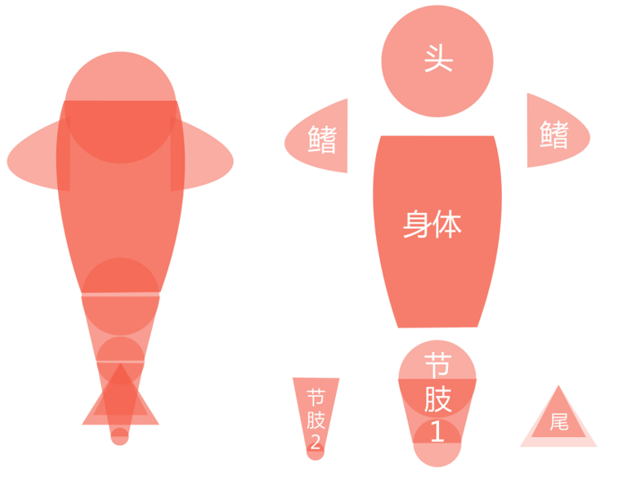
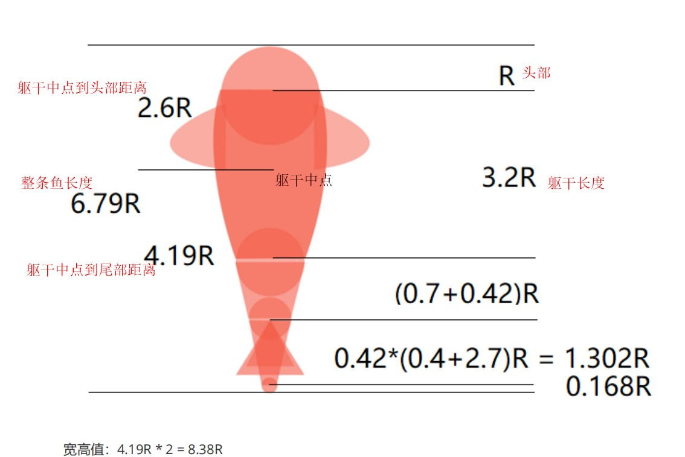
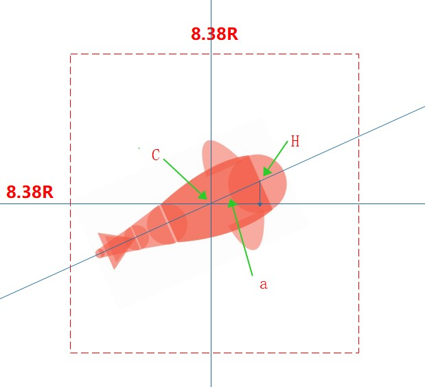

## 实战：绘制游动的小鱼

> 分析效果

1. 小鱼身体的各个部件都是简单的半透明几何图形

2. 各个部件都可以活动

3. 从头到尾摆动的幅度越来越大

   

> 如何实现

**拆分实现，逐步击破思路，先静态后动态，先画鱼，在实现动画部分**

1. 绘制静态小鱼

2. 实现小鱼原地摆动

3. 实现小鱼点击游动

   

> 小鱼结构分解图



> Drawable

**优点**

- 使用简单，比自定义成本低
- 非图片类的Drawable占用空间小，可以减少apk大小


> 使用Path要注意的点

用drawPath绘制之后，Path的路径还是会存在的，所以如果需要绘制新的路径之前，要调用path.reset方法清除之前的路径


> 理解Canvas的离屏缓存

canvas.saveLayerXXX方法就是所谓的离屏缓冲，可以理解为在屏幕外再创建一张图层进行绘制，调用restore将这个Layer绘制到屏幕,而save方法是单纯保存当前的数据


> 自定义Drawble重要的函数介绍

```java
public class FishDrawable extends Drawable {

    private Paint paint;

    public FishDrawable() {
        paint = new Paint();
        paint.setAntiAlias(true);//抗锯齿
        paint.setDither(true);//防抖，设置后可以使页面更加光滑
        paint.setStyle(Paint.Style.FILL);
        paint.setARGB(110,244,92,71);
    }

    //TODO 绘制的时候会调用这个方法
    @Override
    public void draw(@NonNull Canvas canvas) {

    }

    //TODO 设置Drawable的透明度
    //TODO 一般是用这个值来设置画笔
    @Override
    public void setAlpha(int alpha) {
		paint.setAlpha(alpha);
    }

    //TODO 设置颜色过滤器，可以改变绘制内容
    //TODO  设置在画笔上
    @Override
    public void setColorFilter(@Nullable ColorFilter colorFilter) {
		paint.setColorFilter(colorFilter);
    }

    //TODO 根据setAlpha设置的值来决定返回值
    //TODO  alpha==0  返回  PixelFormat.TRANSPARENT
    //TODO alpha == 255     PixelFormat.OPAQUE
    //TODO alpha == 其他   PixelFormat.TRANSLUCENT
    @Override
    public int getOpacity() {

        return PixelFormat.TRANSLUCENT;
    }
}
```

> 规定鱼的宽高



躯干中点是鱼做旋转的**轴点**，所以要完全容纳这条鱼，最小的宽高是4.19R*2

==8.38R,即FishDrawable是一个8.38R的正方形Drawable,躯干中点是正方形的中心，所以再View视图坐标系下**躯干中点的坐标是：（4.19R，4.19R）**

设置FishDrawabled的宽高

```java
class FishDrawable  extends Drawable{

....

    //TODO 设置Drawable的宽
    @Override
    public int getIntrinsicWidth() {
        return (int) (8.38f*HEAD_RADIUS);
    }

    //TODO 设置Drawable的高
    @Override
    public int getIntrinsicHeight() {
        return (int) (8.38f*HEAD_RADIUS);
    }
}
```

一般Drawable是没有宽高的，这里重写方法设置宽高具体大小，一般搭配ImageView使用wrapcontent


> 计算头部圆圈中心坐标



如上图，C是躯干中点，坐标是（4.19R，4.19R）

H是鱼头部的圆圈中心，假设坐标为（x,y）

a是夹角

鱼头的中心到躯干中点的距离等去躯干距离的一半即1.6R==CH

所以

sina = (y-4.19R)/1.6R   ===》y = 1.6RSina+4.19R

cosa = (x-4.19R)/1.6R  ===>x = Cosa1.6R+4.19R

**注意：**

在Android中的Math.sin()\Math.cos()的参数是弧度不是角度

Math.toRadians将角度转成弧度

**所以已知一点坐标求另外一点坐标：**

```java
  public PointF calculatePoint(PointF startPoint, float length, float angle) {

        float deltaX = (float) (Math.cos(Math.toRadians(angle)) * length);
      //TODO 平面直角坐标系与计算机坐标系，X轴方向是一样的，Y轴方向是相反的
      //TODO 所以在利用角度计算X轴的值，还是按照原来平面直角坐标系的算法
      //TODO 计算Y轴的值，则需要在平面直角坐标系的算法计算值之后取反
      //TODO  所以在计算detaY的时候角度要-180
      //TODO 或者 float deltaY = - (float) (Math.sin(Math.toRadians(angle)) * length);
        float deltaY = (float) (Math.sin(Math.toRadians(angle - 180)) * length);
        return new PointF(startPoint.x + deltaX, startPoint.y + deltaY);

    }
```

**画鱼头**

```java
 //画鱼头
    private void drawHead(@NonNull Canvas canvas) {
     
        PointF headPoint = calculatePoint(middlePoint, FISH_BODY_LEN / 2, fishAngle);
        canvas.drawCircle(headPoint.x,headPoint.y,HEAD_RADIUS,paint);
    }
```


