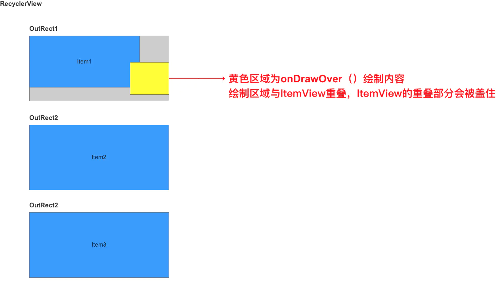
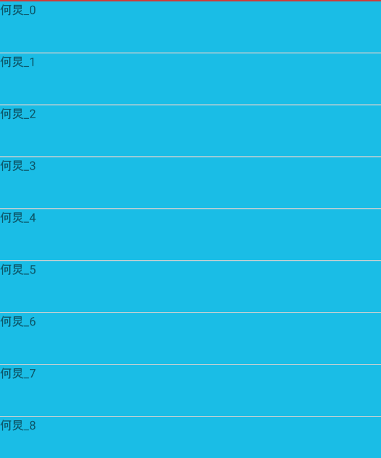
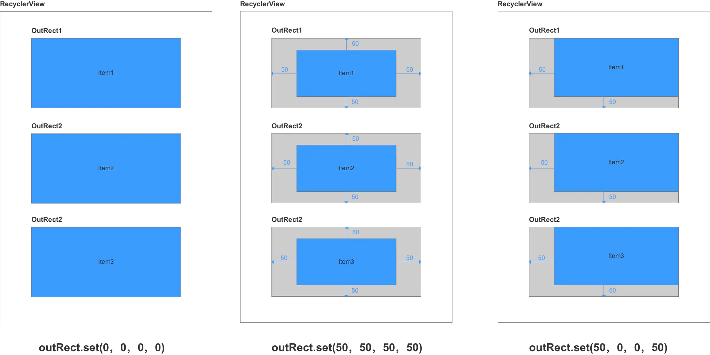

> ItemDecoration

```java
public abstract static class ItemDecoration {
 
    	//绘制
        public void onDraw(@NonNull Canvas c, @NonNull RecyclerView parent, @NonNull 			State state) {
            onDraw(c, parent);
        }

   		//绘制
        public void onDrawOver(@NonNull Canvas c, @NonNull RecyclerView parent,
                @NonNull State state) {
            onDrawOver(c, parent);
        }

        //设置Item的偏移
        public void getItemOffsets(@NonNull Rect outRect, @NonNull View view,
                @NonNull RecyclerView parent, @NonNull State state) {
                
            getItemOffsets(outRect, ((LayoutParams) 			     view.getLayoutParams()).getViewLayoutPosition(),
                    parent);
        }
    }
```

**理解onDrawOver与onDraw的区别**

onDraw是在ItemView绘制之前绘制的，如果onDraw绘制占用的空间大于预留的空间则会出现下图的情况


而onDrawOver是在Item View绘制之后绘制，如果onDrawOver绘制占用的空间比预留的空间大的化会出现下面的情况：



所以总结来说绘制的先后顺序是：ondraw------>ItemView------------->onDrawOver


> DividerItemDecoration

DividerItemDecoration是RecyclerView.ItemDecorationd的实现类，也是官方目前提供的唯一一个实现类。

**注意点**：

DividerItemDecoration 是搭配LinearLayoutManager使用

```java
DividerItemDecoration(this,DividerItemDecoration.VERTICAL)
```

DividerItemDecoration.VERTICAL 表示在竖直方向上添加分割线



**DividerItemDecoration.HORIZONTAL表示在水平方向上添加分割线**

```java
 private void drawVertical(Canvas canvas, RecyclerView parent) {
        canvas.save();
        final int left;
        final int right;
        //noinspection AndroidLintNewApi - NewApi lint fails to handle overrides.
     //getClipToPadding为true表示padding要Clip掉
     //意思就是不能在Padding区域画东西，要排除Padding区域
        if (parent.getClipToPadding()) {
            //所以最左边可画边界时PaddingLeft
            left = parent.getPaddingLeft();
             //所以最右边边可画边界
            right = parent.getWidth() - parent.getPaddingRight();
            //直接裁剪缩小画布可画区域
            canvas.clipRect(left, parent.getPaddingTop(), right,
                    parent.getHeight() - parent.getPaddingBottom());
        } else {
            left = 0;
            right = parent.getWidth();
        }

        final int childCount = parent.getChildCount();
        for (int i = 0; i < childCount; i++) {
            final View child = parent.getChildAt(i);
            parent.getDecoratedBoundsWithMargins(child, mBounds);
            final int bottom = mBounds.bottom + Math.round(child.getTranslationY());
            final int top = bottom - mDivider.getIntrinsicHeight();
            //mDivider是Drawable
            mDivider.setBounds(left, top, right, bottom);
            mDivider.draw(canvas);
        }
        canvas.restore();
    }
```


**理解getItemOffsets的作用：**

```java
public void getItemOffsets(Rect outRect, View view, RecyclerView parent,
            RecyclerView.State state) {
        if (mDivider == null) {
            outRect.set(0, 0, 0, 0);
            return;
        }
        if (mOrientation == VERTICAL) {
            //作用是告诉RecyclerView的ItemView上下左右要留出多少空间
            //流出来的空间是用来绘制Decoration
            outRect.set(0, 0, 0, mDivider.getIntrinsicHeight());
        } else {
            outRect.set(0, 0, mDivider.getIntrinsicWidth(), 0);
        }
    }
```




> RecyClerView.Adapter中getChildLayoutPosition(view)与getChildAdapterPosition(view)的区别