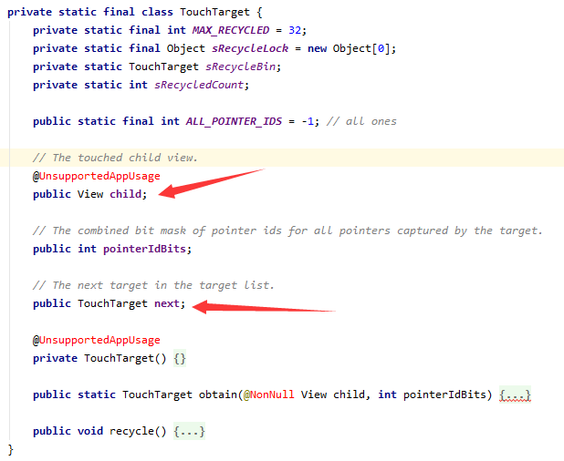

### 事件分发的流程

Activity 

```java
 public boolean dispatchTouchEvent(MotionEvent ev) {
        if (ev.getAction() == MotionEvent.ACTION_DOWN) {
            onUserInteraction();
        }
     //TODO 调用PhoneWindow
        if (getWindow().superDispatchTouchEvent(ev)) {
            return true;
        }
        return onTouchEvent(ev);
    }
```

PhoneWindow

```java
public boolean superDispatchTouchEvent(MotionEvent event) {
        return mDecor.superDispatchTouchEvent(event);
    }
```

DecorView

```java
public boolean superDispatchTouchEvent(MotionEvent event) {
        return super.dispatchTouchEvent(event);
}
```

**ViewGroup**

```java
public boolean dispatchTouchEvent(MotionEvent ev) {
    //...
 if (onFilterTouchEventForSecurity(ev)) {//TODO 判断屏幕是否模糊，被遮挡，

       if (actionMasked == MotionEvent.ACTION_DOWN) {
  				//TODO 如果是Down则重置状态
                cancelAndClearTouchTargets(ev);
                resetTouchState();
       }
     
     	//TODO 询问自身是否拦截
		final boolean intercepted;
if (actionMasked == MotionEvent.ACTION_DOWN
                    || mFirstTouchTarget != null) {//TODO mFirstTouchTarget 很重要
    
    //TODO 是否设置了不允许拦截
          final boolean disallowIntercept = (mGroupFlags & FLAG_DISALLOW_INTERCEPT) != 0;
    
                if (!disallowIntercept) {
                    //允许拦截，则询问自身是否拦截
                    intercepted = onInterceptTouchEvent(ev);
                    ev.setAction(action); // restore action in case it was changed
                } else {
                    intercepted = false;
                }
            } else {
                // There are no touch targets and this action is not an initial down
                // so this view group continues to intercept touches.
                intercepted = true;
			}
     
}       
     
 }
    
    //TODO 不是取消事件，父View也不拦截
    //TODO 那么准备将事件传递给孩子，
	//这里是将事件传递孩子部分分为两部分，Down事件放这里，move事件up事件放其他地方
    if (!canceled && !intercepted) {
        //这里可以看出只处理孩子的down事件，孩子的move事件，up事件这部分逻辑是放在下文
        //这么做是因为Down时要做一些特殊处理
          if (actionMasked == MotionEvent.ACTION_DOWN
                        || (split && actionMasked == MotionEvent.ACTION_POINTER_DOWN)
                        || actionMasked == MotionEvent.ACTION_HOVER_MOVE) {
         //对View进行层级排序     
               final ArrayList<View> preorderedList = buildTouchDispatchChildList();
                        final boolean customOrder = preorderedList == null
                                && isChildrenDrawingOrderEnabled();
                        final View[] children = mChildren;
              
          for (int i = childrenCount - 1; i >= 0; i--) {
              
             //TODO canReceivePointerEvents 判断View能不能接受事件，不可见和做动画时不能接受事件
        //TODO isTransformedTouchPointInView 判断事件在不在View上面   
          if (!child.canReceivePointerEvents()
              || !isTransformedTouchPointInView(x, y, child, null)) {
                                ev.setTargetAccessibilityFocus(false);
                                continue;
            }

              
              //TODO 真正分发事件给孩子，如果某个孩子消费这个事件
              //TODO  第三个参数child，传入当前的孩子
                 if (dispatchTransformedTouchEvent(ev, false, child, idBitsToAssign)) {
                     //TODO 将这个孩子保存在TouchTarget
                     //TODO 在链表头部插入，自己变成头节点
                      newTouchTarget = addTouchTarget(child, idBitsToAssign);
                 }
          }
    }
    
    
    //事件ViewGroup要自己拦截 ，将事件分发给自己
    if (mFirstTouchTarget == null) {
                // No touch targets so treat this as an ordinary view.
        //第三个参数child传入null,表示自己ViewGroup要处理
                handled = dispatchTransformedTouchEvent(ev, canceled, null,
                        TouchTarget.ALL_POINTER_IDS);
     } 
        //TOOD 这里就是上文提到的孩子的的move事件 up事件的分发
        //TODO 单独放这里了，不和孩子Down事件的分发放一起
      else {
                // Dispatch to touch targets, excluding the new touch target if we already
                // dispatched to it.  Cancel touch targets if necessary.
                TouchTarget predecessor = null;
                TouchTarget target = mFirstTouchTarget;
                while (target != null) {
                    final TouchTarget next = target.next;
                    if (alreadyDispatchedToNewTouchTarget && target == newTouchTarget) {
                        handled = true;
                    } else {
                        final boolean cancelChild = resetCancelNextUpFlag(target.child)
                                || intercepted;
                        if (dispatchTransformedTouchEvent(ev, cancelChild,
                                target.child, target.pointerIdBits)) {
                            handled = true;
                        }
                        if (cancelChild) {
                            if (predecessor == null) {
                                mFirstTouchTarget = next;
                            } else {
                                predecessor.next = next;
                            }
                            target.recycle();
                            target = next;
                            continue;
                        }
                    }
                    predecessor = target;
                    target = next;
                }
            } 
    
}
```


```java
    private boolean dispatchTransformedTouchEvent(MotionEvent event, boolean cancel,
            View child, int desiredPointerIdBits) {
        final boolean handled;

        // Canceling motions is a special case.  We don't need to perform any transformations
        // or filtering.  The important part is the action, not the contents.
        final int oldAction = event.getAction();
        if (cancel || oldAction == MotionEvent.ACTION_CANCEL) {
            event.setAction(MotionEvent.ACTION_CANCEL);
            if (child == null) {
                //child 传nulll,表示ViewFroup自己要消费事件
                //调用View 的dispatchTouchEvent
                handled = super.dispatchTouchEvent(event);
            } else {
                //孩子自己消费事件
                handled = child.dispatchTouchEvent(event);
            }
            event.setAction(oldAction);
            return handled;
        }
```

**View**

```java
    public boolean dispatchTouchEvent(MotionEvent event) {
      
        boolean result = false;


        if (onFilterTouchEventForSecurity(event)) {
            if ((mViewFlags & ENABLED_MASK) == ENABLED && handleScrollBarDragging(event)) {
                result = true;
            }
            //noinspection SimplifiableIfStatement
            ListenerInfo li = mListenerInfo;
            //TODO 设置了OnTouchListener
            //则调用OnTouchListener.onTouch
            if (li != null && li.mOnTouchListener != null
                    && (mViewFlags & ENABLED_MASK) == ENABLED
                    && li.mOnTouchListener.onTouch(this, event)) {
                result = true;
            }

            //TODO OnTouchListener  没设置  或者onTouch返回false
            //TODO  则调用onTouchEvent这个重写方法
            //TODO onTouchEvent内部包含onclickListener的执行
            //TODO 所以说OnClicListener(OntouchEvent)的优先级低于OnTouListener
            //TODO 或者说onClick方法优先级低于Ontouch方法
            if (!result && onTouchEvent(event)) {
                result = true;
            }
        }

        if (!result && mInputEventConsistencyVerifier != null) {
            mInputEventConsistencyVerifier.onUnhandledEvent(event, 0);
        }

        if (actionMasked == MotionEvent.ACTION_UP ||
                actionMasked == MotionEvent.ACTION_CANCEL ||
                (actionMasked == MotionEvent.ACTION_DOWN && !result)) {
            stopNestedScroll();
        }

        return result;
    }
```


```java
  private TouchTarget addTouchTarget(@NonNull View child, int pointerIdBits) {
        final TouchTarget target = TouchTarget.obtain(child, pointerIdBits);
        target.next = mFirstTouchTarget;//TODO 在头部插入
        mFirstTouchTarget = target;//TODO 当前target 变成FirstTarget
        return target;
    }
```


> OnClickListener与OnTouchListener的优先级

OnTouchListener优先级更加高，如果OnTouchListener的onTouch返回了true,则onTouchEvent不会执行，那么包含在onTouchEvent里面的OnClickListener也不会执行。


> 孩子请求父View不拦截事件

这是ViewGroup提供给孩子的方法，可以请求父View不拦截事件，这么设计的原因是因为事件是从父View流向孩子，保留此设计相当于给了孩子公平竞争事件的机会

```java
public void requestDisallowInterceptTouchEvent(boolean disallowIntercept) {

        if (disallowIntercept == ((mGroupFlags & FLAG_DISALLOW_INTERCEPT) != 0)) {
            // We're already in this state, assume our ancestors are too
            return;
        }

        if (disallowIntercept) {//TODO 改变标记位来表示拦截与否
            mGroupFlags |= FLAG_DISALLOW_INTERCEPT;
        } else {
            mGroupFlags &= ~FLAG_DISALLOW_INTERCEPT;
        }

        // Pass it up to our parent
        if (mParent != null) {
            mParent.requestDisallowInterceptTouchEvent(disallowIntercept);
        }
    }
```

> mFirstTouchTarget的误解

mFirstTouchTarget是Android用来保存能够处理当前事件的View，之前没有细看源码一直以为mFirstTouchTarget只是对View的包装，以为只能保存一个View，实际上并非如此，mFirstTouchTarget实际上是一个链表，能保存多个View,为什么设置成链表？比如多点触控，多个手指在多个View，就需要链表保存多个View



