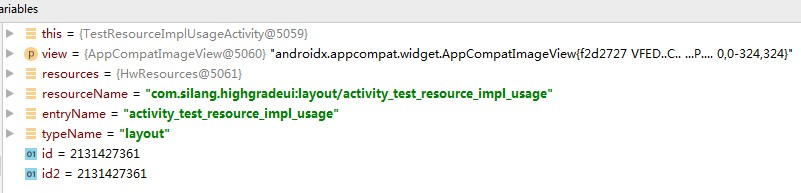
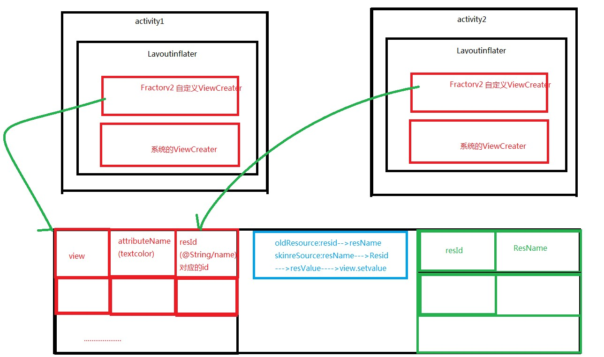

## 网易云动态换肤实战

> 分析网易云音乐皮肤包

adb  shell

su

cd  /data/data/com.netease.cloudmusic/

ls

cd file/theme/


cp      /storage/emulated/0/

 adb  pull   /sdcard/


> resource.arc文件


> 换肤流程

采集需要换肤的控件，放到集合中，只有用了支持换肤的属性的View才需要cai

1.使用到background的View

2.使用了（textColor/drawLeft/drawright/drawTop/drawBottom）的TextView

3.ImageView的Src

4.自定义控件的自定义属性


加载皮肤包，如果对应资源再皮肤包中有加载皮肤包的，否则用默认的


> 理解LayoutInflater的Factory2的作用


> 理解LayoutInflater的属性mFactorySet的限制


> 理解LayoutInflater.from(activity)与LayoutInflater.from(getApplicationContext())的区别


> 如何获取所有的Activity的LayoutInflater


> Android系统原生的View所在的包名有哪些


> AssetManager的addAssetPath方法


> Java代码设置资源


> ResourceImpl分析

**Resource重要的方法**

```java
public void doImg(View view) {

        Resources resources = view.getContext().getResources();
    
    //TODO 获取资源名称（全称）
        String resourceName = resources.getResourceName(R.layout.activity_test_resource_impl_usage);
    
    //TODO 获取资源名称（短称）
        String entryName = resources.getResourceEntryName(R.layout.activity_test_resource_impl_usage);
    
    //TODO 获取资源类型名称
        String typeName = resources.getResourceTypeName(R.layout.activity_test_resource_impl_usage);
    
    //TODO 获取资源id,通过全名短名都可以
        int id = resources.getIdentifier(resourceName, typeName, resources.getResourcePackageName(R.layout.activity_test_resource_impl_usage));
        int id2 = resources.getIdentifier(entryName, typeName, resources.getResourcePackageName(R.layout.activity_test_resource_impl_usage));

        Log.d("", "");
    }
```




