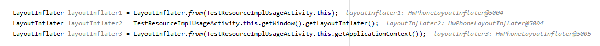
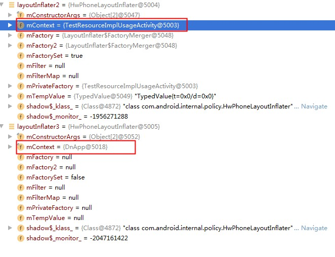

## 网易云动态换肤技能点总结


> 换肤流程

**采集需要换肤的控件，放到集合中，只有用了支持换肤的属性的View才可能是要换肤的View**

1.使用到background的View

2.使用了（textColor/drawLeft/drawright/drawTop/drawBottom）的TextView

3.ImageView的Src

4.自定义控件的自定义属性

**加载皮肤包，如果对应资源再皮肤包中有加载皮肤包的，否则用宿主App默认的资源**


> 理解LayoutInflater的Factory2的作用

Android 使用LayoutInflater解析XML文件生成View，

```java
 View inflate(XmlPullParser parser, @Nullable ViewGroup root, boolean attachToRoot) {
 	
     //......
     
     //TODO 生成View
     final View temp = createViewFromTag(root, name, inflaterContext, attrs);

     ViewGroup.LayoutParams params = null;

     if (root != null) {
     	params = root.generateLayoutParams(attrs);
        if (!attachToRoot) { 
            //TODO 这里要特别注意咯，
            //TODO root不空attachToRoot为false的时候
            //TODO xml中各种layout_XXX属性才会被设置到temp中
            //TODO 否则为空
           temp.setLayoutParams(params);
         }
     }
 
 }
```


```java
View createViewFromTag(View parent, String name, Context context, AttributeSet attrs,
        boolean ignoreThemeAttr) {
    
    //TODO 可以看到如果tryCreateView生成的View不空
    //TODO 下方if语句代码块是不执行的
    //TODO 默认情况下tryCreateView创建的view是空的
     View view = tryCreateView(parent, name, context, attrs);

     if (view == null) {
           final Object lastContext = mConstructorArgs[0];
           mConstructorArgs[0] = context;
           try {
               //包含“.”，说明是自定义View的全类名
               if (-1 == name.indexOf('.')) {
                    view = onCreateView(context, parent, name, attrs);
                } else {
                   //TODO Android系统View
                    view = createView(context, name, null, attrs);
                }
           } finally {
                    mConstructorArgs[0] = lastContext;
           }
     }

      return view;
}
```


```java
public final View tryCreateView(@Nullable View parent, @NonNull String name,
        @NonNull Context context,
        @NonNull AttributeSet attrs) {
        if (name.equals(TAG_1995)) {
            // Let's party like it's 1995!
            //TODO 闪烁布局
            return new BlinkLayout(context, attrs);
        }

        View view;
    //TODO  下方分别开始尝试Factory2、Factory、privateFactory（实际类型也是Factory2）创建View
    //TODO 默认这三个factory都是null,没有设置的
        if (mFactory2 != null) {
            view = mFactory2.onCreateView(parent, name, context, attrs);
        } else if (mFactory != null) {
            view = mFactory.onCreateView(name, context, attrs);
        } else {
            view = null;
        }

        if (view == null && mPrivateFactory != null) {
            view = mPrivateFactory.onCreateView(parent, name, context, attrs);
        }

        return view;
    }
```

所以可以将LayoutInflater中的Factory2看做是Android系统一种预留的后门，如果设置了Factory则Android原来的生成View的逻辑将被跳过，生成View的逻辑直接运行Factory中的逻辑，相当于设置Factory的话，Factory则接管了生成View的活了。


> Factory与Factory2区别

Factory继承Factory，不同之处在于Factory2的onCreateView多了一个 View parent参数

```java
public interface Factory {
       
        @Nullable
        View onCreateView(@NonNull String name, @NonNull Context context,
                @NonNull AttributeSet attrs);
    }
```

```java
public interface Factory2 extends Factory {
    
        @Nullable
        View onCreateView(@Nullable View parent, @NonNull String name,
                @NonNull Context context, @NonNull AttributeSet attrs);
    }
```


> 理解LayoutInflater的属性mFactorySet的限制

LayoutInflater如果设置过Factory,mFactorySet被设置成true,如果在此设置Factory则会抛出异常。

所以确保LayoutInflater的Factory设置成功，在设置前可以反射设置mFactorySet为false


```java
 public void setFactory(Factory factory) {
     
     //TODO 再次设置Factory会抛出异常
        if (mFactorySet) {
            throw new IllegalStateException("A factory has already been set on this LayoutInflater");
        }
        if (factory == null) {
            throw new NullPointerException("Given factory can not be null");
        }
        mFactorySet = true;
        if (mFactory == null) {
            mFactory = factory;
        } else {
            mFactory = new FactoryMerger(factory, null, mFactory, mFactory2);
        }
    }
```

ayoutInflater设置Factory,反射设置mFactorySet为false:

```java
  
  Field mFactorySetField = LayoutInflater.class.getDeclaredField("mFactorySet");
  mFactorySetField.setAccessible(true);
  mFactorySetField.setBoolean(inflater, false);

  SkinLayoutFactory factory2 = new SkinLayoutFactory();
  LayoutInflaterCompat.setFactory2(inflater, factory2);

```


> 理解LayoutInflater.from(activity)与LayoutInflater.from(getApplicationContext())的区别



上图可以看出LayoutInflater.from(activity)与LayoutInflater.from(getApplicationContext())获取的不是同一个LayoutInflater,而同一个Activity和PhoneWindow的LayoutInflater是同一个，两者创建出来的LayoutInflater主要不同在于Context，Activity的LayoutInflater的Context是Activity，Application的LayoutInflater的Context是Application





> 如何获取所有的Activity的LayoutInflater

一般全局获取Activity相关的东西可以考虑注册Application.ActivityLifecycleCallbacks监听，全局Activity的生命周期都可以监听，如下：

```java
public class SkinActivityLifeCycle implements Application.ActivityLifecycleCallbacks {

    @Override
    public void onActivityCreated(@NonNull Activity activity, @Nullable Bundle savedInstanceState) {
        //TODO 获取Activity关联的LayoutInflater
        //TODO 每创建一个Activity时onActivityCreated都会被回调
        LayoutInflater inflater = LayoutInflater.from(activity);
    }
    
    
   //TODO ....
}
```

```java

public class MyApp extends Application {

    @Override
    public void onCreate() {
        super.onCreate();
        //注册监听全局Activity的生命周期监听
        registerActivityLifecycleCallbacks(new SkinActivityLifeCycle());
    }
}
```


> AssetManager的addAssetPath方法

```java
   public int addAssetPath(String path) {
        return addAssetPathInternal(path, false /*overlay*/, false /*appAsLib*/);
    }
```

将path路径的资源加载，应用程序怎么访问path路径下的资源呢，直接通过AssetManager是不行的，AssetManager只是负责加载资源，通过Resource--->ResourceImpl---->AssetManager这样的包装，应用程序通过Resource对象可以获取AssetManager加载的资源。

在Android 系统中AssetManager的构造方法虽然是public的但是被标注了@hide,无法直接new出一个AssetManager对象，所以只能使用反射创建，以下代码展示使用AssetManager加载资源

```java
//TODO 反射创建AssetManager
AssetManager assetManager = AssetManager.class.newInstance();

//TODO 反射调用addAssetPath方法
Method addAssetPathMethod = assetManager.getClass().getDeclaredMethod("addAssetPath", String.class);
addAssetPathMethod.setAccessible(true);
addAssetPathMethod.invoke(assetManager, path);

//TODO Resources包装AssertManager,从而可以访问资源
//TODO resource里面实际上不是直接包装AssertManager，而是用ResourceImpl去直接包装
//TODO Resource--->ResourceImpl---->AssetManager
Resources skinresource = new Resources(assetManager, appResource.getDisplayMetrics(), appResource.getConfiguration());

```


> Resource分析

**Resource重要的方法**

```java
public void doImg(View view) {

        Resources resources = view.getContext().getResources();
    
    //TODO 获取资源名称（全称）
        String resourceName = resources.getResourceName(R.layout.activity_test_resource_impl_usage);
    
    //TODO 获取资源名称（短称）
        String entryName = resources.getResourceEntryName(R.layout.activity_test_resource_impl_usage);
    
    //TODO 获取资源类型名称
        String typeName = resources.getResourceTypeName(R.layout.activity_test_resource_impl_usage);
    
    //TODO 获取资源id,通过全名短名都可以
        int id = resources.getIdentifier(resourceName, typeName, resources.getResourcePackageName(R.layout.activity_test_resource_impl_usage));
        int id2 = resources.getIdentifier(entryName, typeName, resources.getResourcePackageName(R.layout.activity_test_resource_impl_usage));

        Log.d("", "");
    }
```


> Java中内置的Observer与Observabled的使用

```java

public class MyClass {

    public static void main(String[] args) {

        MyObserver observer = new MyObserver();
        MyObservable observable = new MyObservable();
        //TODO 订阅
        observable.addObserver(observer);
        //TODO 发布事件
        observable.sayChanged();
    }
    
    static class  MyObserver implements Observer {

        @Override
        public void update(Observable observable, Object o) {
            System.out.println("anhao =  "+o);
        }
    }

    static class MyObservable extends  Observable{
        
        void sayChanged(){
            //TODO  setchanged不能漏掉
            //TODO 否则observerb不会收到
            setChanged();
            notifyObservers("123456");
        }
    }

}
```

